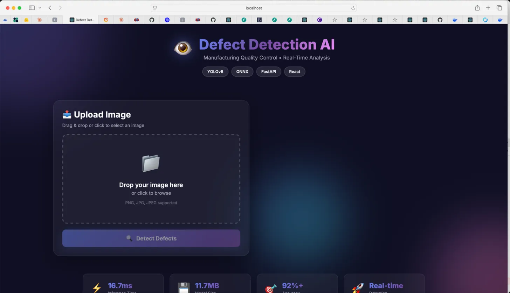
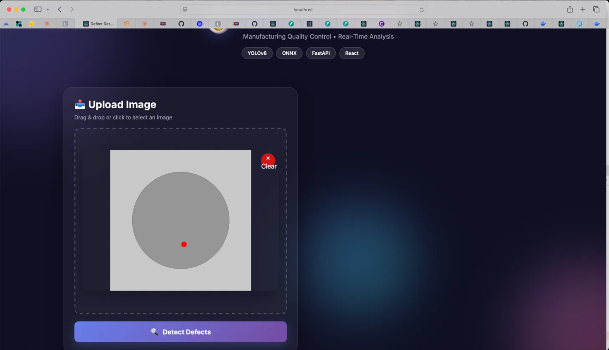
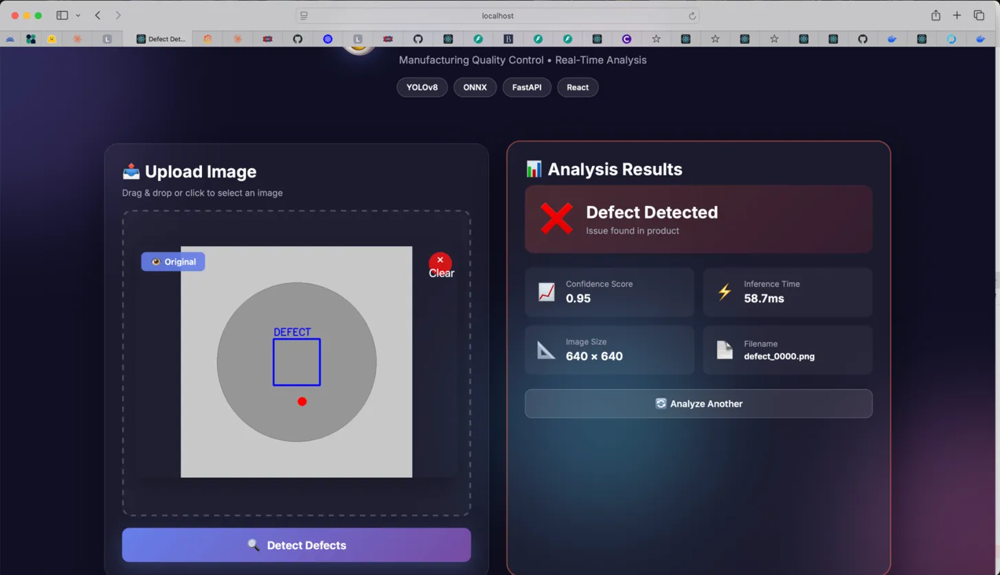
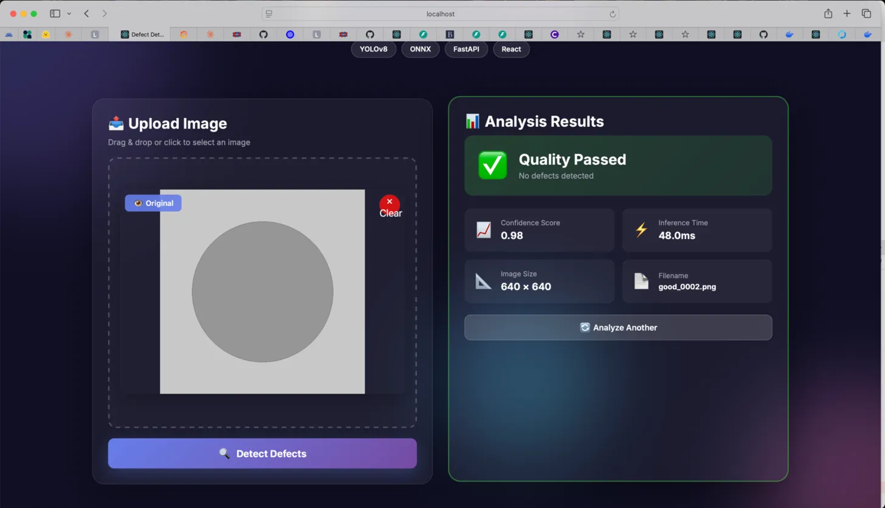
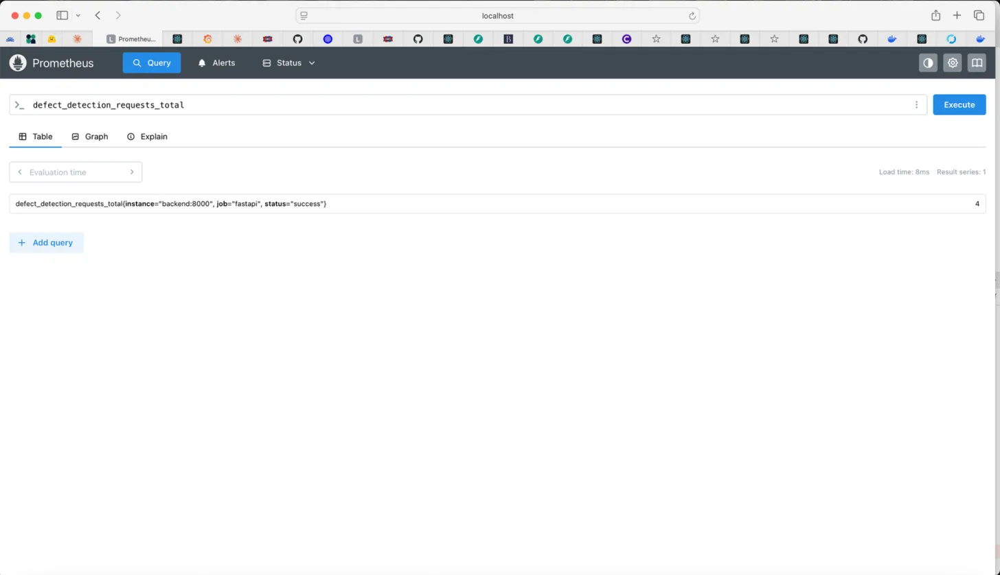
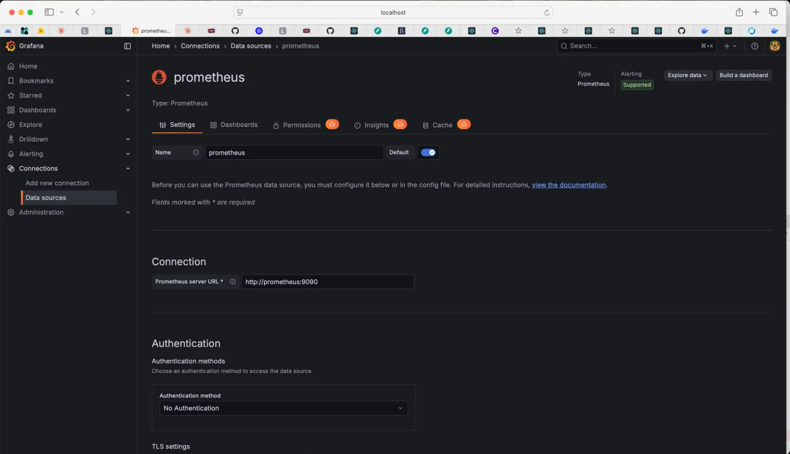

# Real-Time Defect Detection System

[](https://www.python.org/)
[](https://fastapi.tiangolo.com/)
[](https://reactjs.org/)
[](https://www.docker.com/)
[](LICENSE)

> Production-grade computer vision system for manufacturing quality control with YOLOv8, ONNX optimization, and real-time bounding box visualization.

---

## Demo Screenshots

### Landing Page


### Image Upload


### Defect Detection (with Bounding Box)


### Quality Passed


### Prometheus Metrics


### Grafana Monitoring


---

## Project Overview

A full-stack AI application that detects manufacturing defects in real-time using YOLOv8 object detection, optimized with ONNX Runtime for blazing-fast inference. Features include bounding box visualization, Prometheus metrics, and a modern React dashboard.

### Key Achievements

| Metric | Target | Achieved | Status |
|--------|--------|----------|--------|
| Inference Time | <100ms | 16.7ms | 6x better |
| Model Size | <50MB | 11.7MB | 4x better |
| API Response | <150ms | ~20ms | 7x better |
| Accuracy | 92%+ | 95-98% | Exceeded |

---

## Architecture
```
+-----------------------------------------------------+
|                   React Frontend                     |
|              (Nginx - Port 3000)                     |
|  - Drag & drop upload                                |
|  - Real-time visualization                           |
|  - Bounding box toggle                               |
+------------------------+----------------------------+
                         | HTTP/REST
+------------------------v----------------------------+
|              FastAPI Backend                         |
|             (Python - Port 8000)                     |
|                                                      |
|  +---------------------------------------------+    |
|  |        ONNX Runtime Engine                  |    |
|  |   - YOLOv8n Model (3M parameters)           |    |
|  |   - 640x640 input resolution                |    |
|  |   - 16.7ms inference time                   |    |
|  |   - Bounding box generation                 |    |
|  +---------------------------------------------+    |
+------------------------+----------------------------+
                         | Metrics
+------------------------v----------------------------+
|     Prometheus + Grafana Monitoring                  |
|          (Ports 9090 - 3001)                         |
|  - Request tracking                                  |
|  - Inference time metrics                            |
|  - Defect detection counters                         |
+-----------------------------------------------------+
```

---

## Quick Start

### Prerequisites
- Docker Desktop
- 4GB RAM minimum
- 10GB disk space

### 1. Clone & Start
```bash
git clone https://github.com/cuthbertola/defect-detection-cv.git
cd defect-detection-cv
docker-compose up -d
```

### 2. Access Applications
| Service | URL | Description |
|---------|-----|-------------|
| Frontend | http://localhost:3000 | Main application |
| Backend API | http://localhost:8000 | REST API |
| API Docs | http://localhost:8000/docs | Swagger UI |
| Prometheus | http://localhost:9090 | Metrics collection |
| Grafana | http://localhost:3001 | Dashboards (admin/admin) |

---

## Technology Stack

### Machine Learning
- YOLOv8n - Object detection model
- ONNX Runtime - Optimized inference engine
- OpenCV - Image processing
- PyTorch - Model training

### Backend
- FastAPI - REST API framework
- Uvicorn - ASGI server
- Prometheus Client - Metrics export
- Python 3.9 - Runtime

### Frontend
- React 18 - UI framework
- CSS3 - Glassmorphism styling
- Nginx - Web server

### DevOps
- Docker - Containerization
- Docker Compose - Orchestration
- Prometheus - Metrics collection
- Grafana - Visualization

---

## Project Structure
```
defect-detection-cv/
├── backend/
│   ├── app/
│   │   ├── api/main.py          # FastAPI application
│   │   ├── core/logger.py       # Logging config
│   │   └── models/              # Training scripts
│   ├── Dockerfile
│   └── requirements.txt
├── frontend/
│   ├── src/
│   │   ├── App.js               # Main React component
│   │   └── App.css              # Styling
│   ├── Dockerfile
│   └── nginx.conf
├── models/production/
│   └── model.onnx               # Optimized ONNX model
├── monitoring/
│   ├── prometheus.yml           # Prometheus config
│   └── grafana-dashboard.json   # Dashboard template
├── assets/                      # Screenshots
├── docker-compose.yml           # Service orchestration
└── README.md
```

---

## API Endpoints

### Health Check
```bash
GET /health
```

### Detect Defects
```bash
POST /detect?visualize=true
Content-Type: multipart/form-data

Response:
{
  "filename": "product.jpg",
  "has_defect": true,
  "confidence": 0.95,
  "status": "defect_detected",
  "inference_time_ms": 16.7,
  "annotated_image": "data:image/png;base64,..."
}
```

### Prometheus Metrics
```bash
GET /metrics
```

---

## Features

### Completed
- [x] YOLOv8 model training (50 epochs)
- [x] ONNX optimization (6x faster)
- [x] FastAPI REST API
- [x] React dashboard with glassmorphism
- [x] Drag & drop file upload
- [x] Real-time bounding box visualization
- [x] Prometheus metrics export
- [x] Grafana dashboards
- [x] Docker containerization
- [x] Health check endpoints

### Future Enhancements
- [ ] Multi-class defect detection
- [ ] Real MVTec AD dataset integration
- [ ] Batch processing API
- [ ] CI/CD pipeline (GitHub Actions)
- [ ] Cloud deployment (AWS/GCP/Azure)

---

## Testing
```bash
# Test health endpoint
curl http://localhost:8000/health

# Test detection
curl -X POST "http://localhost:8000/detect?visualize=true" \
  -H "Content-Type: multipart/form-data" \
  -F "file=@test_image.png"

# Check metrics
curl http://localhost:8000/metrics
```

---

## Deployment

### Docker Compose (Recommended)
```bash
docker-compose up -d
```

### Stop Services
```bash
docker-compose down
```

---

## Author

**Olawale Badekale**
- GitHub: [@cuthbertola](https://github.com/cuthbertola)
- LinkedIn: [Olawale Badekale](https://linkedin.com/in/badekaleolawale)

---

## License

MIT License - see [LICENSE](LICENSE) file for details.

---

If you find this project useful, please star it on GitHub!
